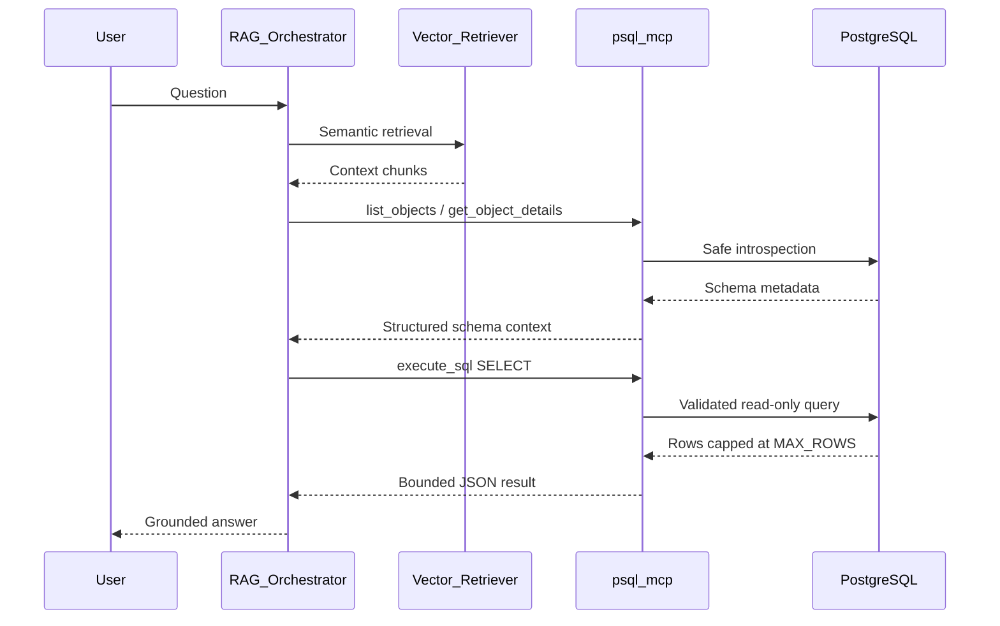

# RAG Integration Guide

This guide explains how **psql-mcp v0.1.0** fits into an agentic RAG (Retrieval-Augmented Generation) architecture.

## Design principle: separation of concerns

| Component | Responsibility |
|-----------|----------------|
| **RAG retriever** | Semantic search over embeddings, documents, and knowledge chunks |
| **psql-mcp** | Live structured data: schema discovery and safe SQL execution |
| **LLM agent** | Orchestrates retrieval, schema exploration, and query generation |

psql-mcp intentionally does **not** handle vector search, embedding generation, or document chunking. Keep those in your RAG pipeline.

---

## Architecture



---

## Integration patterns

### Pattern 1: Cursor agent (stdio)

Best for interactive development and ad-hoc data exploration.

1. Configure [`.cursor/mcp.json`](../.cursor/mcp.json)
2. Agent automatically discovers MCP tools
3. User asks natural-language questions; agent calls schema tools then `execute_sql`

### Pattern 2: Custom RAG orchestrator (streamable-http)

Best for production agentic pipelines where the RAG service runs remotely.

1. Deploy psql-mcp with `TRANSPORT=streamable-http`
2. RAG orchestrator connects via MCP HTTP client
3. Orchestrator injects schema context and query results into the LLM prompt

```env
TRANSPORT=streamable-http
STREAMABLE_HTTP_HOST=0.0.0.0
STREAMABLE_HTTP_PORT=8000
```

### Pattern 3: Sidecar container

Best for Kubernetes deployments.

```
[RAG Pod]
  ├── rag-orchestrator (main)
  └── psql-mcp (sidecar, stdio or localhost HTTP)
         └── PostgreSQL (cluster service)
```

The orchestrator talks to psql-mcp over localhost; psql-mcp talks to Postgres over the cluster network.

---

## Recommended tool call sequence

For agents generating SQL from natural language, follow this sequence to reduce hallucinated columns and tables:

```
1. list_schemas
      ↓
2. list_objects(schema_name="public", object_type="table")
      ↓
3. get_object_details(schema_name="public", object_name="users")
      ↓
4. get_table_relationships(schema_name="public")   [if JOINs needed]
      ↓
5. execute_sql(sql="SELECT ... FROM public.users WHERE ...")
```

**Shortcuts:**

- Use `search_objects(pattern="invoice")` when the table name is known but not the schema
- Use `sample_rows(schema_name="public", table_name="users", limit=5)` for quick data shape inspection
- Use `explain_query(sql="...")` when the agent needs to optimize or debug a slow query

---

## Context window management

RAG agents have limited context windows. psql-mcp helps by bounding all responses:

| Setting | Default | Purpose |
|---------|---------|---------|
| `MAX_ROWS` | 1000 | Cap rows returned per query |
| `MAX_CELL_CHARS` | 500 | Truncate large text/JSON cells |
| `QUERY_TIMEOUT_SEC` | 30 | Prevent runaway queries |

**Recommendations for RAG:**

- Keep `MAX_ROWS` between 50–200 for most agent use cases
- Use `get_object_details` instead of `SELECT *` when the agent only needs schema
- Use `sample_rows` with `limit=5` for data previews
- Ask the agent to write targeted `SELECT` with explicit columns, not `SELECT *`

---

## Example: end-to-end agent flow

**User question:** *"How many orders were placed last month?"*

**Step 1 — RAG retrieval (your vector store):**
```
Retrieved chunks: "orders table tracks purchase_date and status..."
```

**Step 2 — Schema grounding (psql-mcp):**
```json
// get_object_details("public", "orders")
{
  "columns": [
    { "column": "id", "data_type": "integer" },
    { "column": "purchase_date", "data_type": "timestamp with time zone" },
    { "column": "status", "data_type": "text" }
  ]
}
```

**Step 3 — SQL execution (psql-mcp):**
```sql
SELECT COUNT(*) AS order_count
FROM public.orders
WHERE purchase_date >= date_trunc('month', CURRENT_DATE - INTERVAL '1 month')
  AND purchase_date < date_trunc('month', CURRENT_DATE)
```

**Step 4 — Agent response:**
```
There were 1,247 orders placed last month.
```

---

## What not to put in MCP

| Concern | Where it belongs |
|---------|-----------------|
| Document embeddings | Your vector store (pgvector, Pinecone, etc.) |
| Chunking and indexing | RAG ingestion pipeline |
| Semantic similarity search | RAG retriever |
| Schema migrations | Flyway, Alembic, etc. |
| Write operations | Database migration tools (not MCP in production) |

If you need semantic search **over database content**, run embeddings in your RAG pipeline and store vectors in pgvector. Use psql-mcp only when the agent needs **live, structured query results**.

---

## Security in RAG contexts

Agents are susceptible to prompt injection. Defense layers:

1. **psql-mcp restricted mode** — blocks destructive SQL even if the agent is tricked
2. **ALLOWED_SCHEMAS** — limits which data the agent can see
3. **mcp_readonly DB role** — second line of defense at the database
4. **MAX_ROWS** — limits data exfiltration volume per query

See [security.md](security.md) for the full production checklist.

---

## Further reading

- [Getting Started](getting-started.md) — install and verify
- [MCP Tools Reference](mcp-tools.md) — full tool API
- [Configuration](configuration.md) — transports and environment variables
- [Troubleshooting](troubleshooting.md) — connection and query issues
